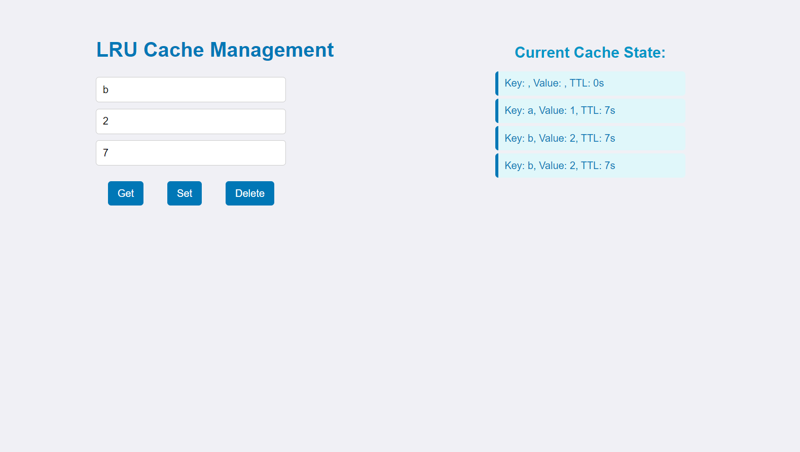

# LRU Cache Management System

This project contains the code for the frontend of LRU cache management system.
This project will run on `http://localhost:3000/` and the backend for this will run on `http://localhost:8080/`

### Both Frontend and Backend should be up and running to make this project work.

## How to run

Follow the below commands.

### `npm install`

### `npm start`

## Screenshot of the application.

